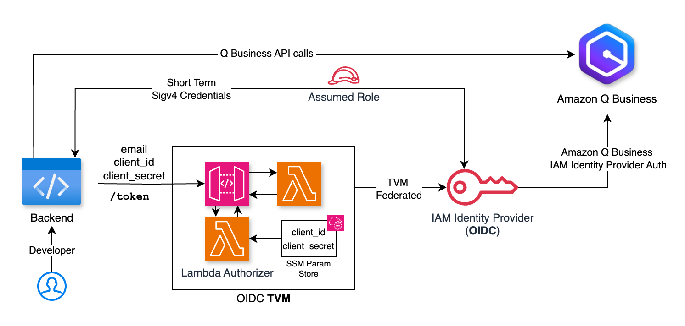
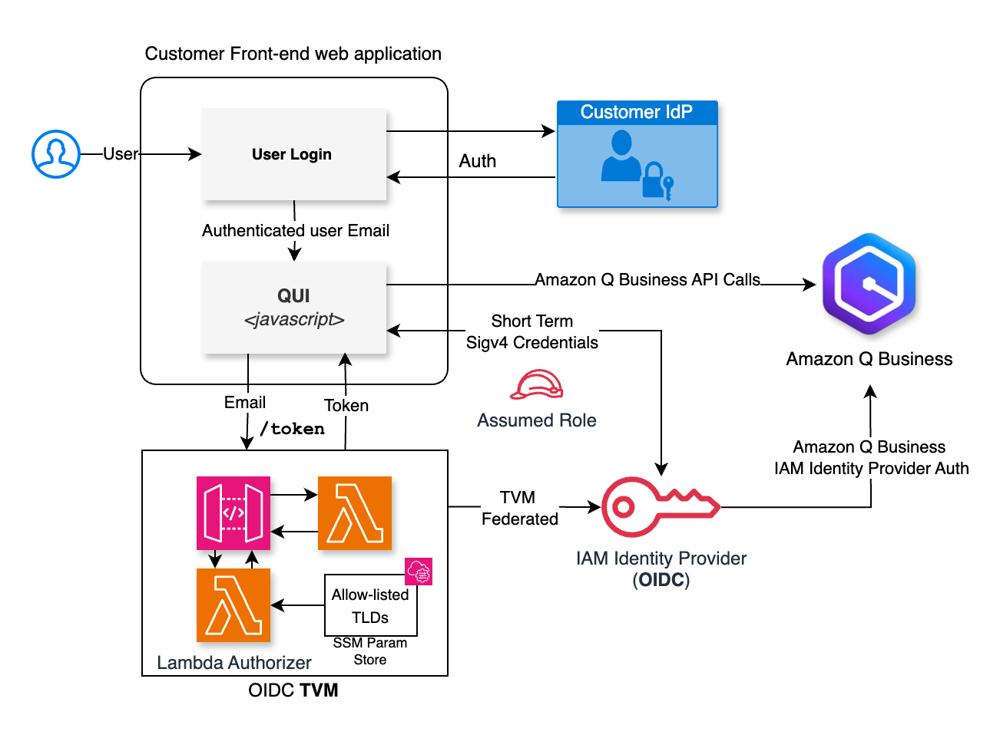
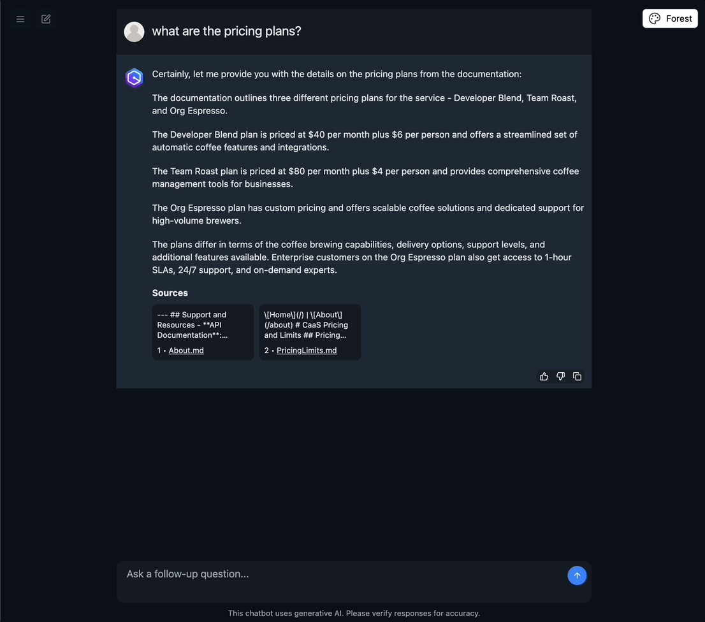

### Amazon Q Business TVM and QUI 🚀

Deploy a fully customizable Amazon Q Business AI Assistant experience.

This solution includes:

#### 1. TVM - Token Vending Machine

The idea is to create a handshake mechanism between customers authenticated apps and Q Business through a secure **token vending machine (TVM)**. The TVM is implemented via a Single Lambda and API gateway using OIDC Specifications and can federate with IAM Identity Provider which is used with Q Business App’s Auth setup . The TVM can accept an email address of any authenticated user and issue an OIDC Token which is used to generate SigV4 credentials in order to assume an identity-aware role for Q Business. This credential is then used to call Q Business APIs. The TVM will be delivered to customers via a CDK application that customers can deploy into their own environments.

The TVM, which acts as an OIDC provider, comes with it’s own issuer url, `/.well-known/openid-configuration`  as well as `/.well-known/jwks.json` endpoints which are OIDC compliant. TVM OIDC provider uses a Public-Private key pair which is encrypted and stored within customer’s AWS SSM Parameter store. The TVM also comes with a `/token` endpoint responsible for issuing OIDC Identity Tokens using the private key. IAM Identity Provider makes use of the /.well-known/* endpoints and the public key to ensure the validity of the OIDC tokens issued by the `/token` endpoint and has permissions to Amazon Q Business API’s via an IAM Role and Trust relationships. In essence, when provided with a valid email address, the token issued by `/token` endpoint will be identity aware and can be used to assume the said IAM Role to generate identity aware SigV4 credentials for Amazon Q Business API calls.



#### 2. QUI - Amazon Q AI Assistant Web Component

In order to build a fully personalized user experience customers are looking for more ways than merely embedding a widget in an iframe which comes with security flaws (Web Experience URL exposure, and several other web vulns that are related to iframes). The solution is to deliver a Web Component with QBusiness AI assistant (chat) features that can be fully customized and used with popular web frameworks such as React, React-native (mobile), Vue, Angular, or even Vanilla JS. The web component — QUI — will be available via NPM, Yarn, and JSDelivr hosting. QUI works with TVM to make direct calls to Q Business APIs using short-term (usually 15 mins) SigV4 credentials using tokens issued by the TVM, using Amazon Q Business JavaScript SDK. Customers can use QUI from within their authenticated UX to natively embed (non-iframe) Q Business AI Assistant functionality.

While QUI depends on TVM to function (at the moment) it can be extended in the future to work with other auth mechanisms (although only IAM Identity Provider based since IDC requires an auth flow to happen and doesn’t provide ways of token handling-off, rather uses permissions sets [more experimentation required here]). TVM on the other hand, can not only be used for QUI, but can be used by customers to build their own applications without having to spend weeks setting up Authentication with Q Business.



### Deploy TVM (Token Vending Machine) for Amazon Q Business

1. Clone this repo and `cd` into `/custom-oidc` directory
2. Run `npm install --save` and create a `.env` file.
3. Enter the following in the `.env` file with the account details of where you want to deploy the stack

```
CDK_DEFAULT_ACCOUNT=<account_id>
CDK_DEFAULT_REGION=<region>
```

4. `cdk bootstrap`
5. `cdk synth`
6. `cdk deploy --require-approval never --outputs-file ./cdk-outputs.json --profile <profile>`
7. Once the stack is deployed note the following values from the stack's output

```
Outputs:
MyOidcIssuerStack.AudienceOutput = xxxxxxx
MyOidcIssuerStack.IssuerUrlOutput = https://xxxxxxx.execute-api.<region>.amazonaws.com/prod/
MyOidcIssuerStack.QBizAssumeRoleARN = arn:aws:iam::XXXXXXXX:role/q-biz-custom-oidc-assume-role

✨  Total time: 64.31s
```

8. The stack will create the TVM (Audience and Issuer endpoints), an IAM Role to assume with Q Business permissions, an IAM Identity Provider already setup with the Issuer and Audience (You should be able to see this Identity Provider from IAM Console)
9. Setup a Q Business App, Select "AWS IAM Identity Provider" (**Note**: Uncheck "Web Experience" from "Outcome" when creating the Q Business App), select "OpenID Connect (OIDC)" provider type for authentication and select the above created Identity Provider from the drop down, in "Client ID" enter the Audience value from the stack output above `AudienceOutput` (also found in `cdk-outputs.json` file that captures the output of stack deployment, or in your Cloudformation stack deployment output).
10. Setup your Q Business App following the rest of the steps by adding data sources etc.

### Deploy sample React App with Custom Amazon Q UI usage

1. Change directory to `amzn-q-custom-ui`.
2. Run `npm install --save` to install dependencies.
3. Create a `.env` file at the root of the directory with these values. Note: the email can be any email 😃

```
VITE_QBIZ_APP_ID=<q-biz-app-id>
VITE_IAM_ROLE_ARN=<iam-role-arn-from-stack-deployment>
VITE_EMAIL=<email address>
VITE_AWS_REGION=<region-where-q-biz-app>
VITE_ISSUER=<issuer-url-from-stack>
```

> NOTE: For production you will need a similar file called `.env.production`

4. Run `npm run dev`
5. Visit your app in `localhost` URL provided by Vite local server 🚀🚀🚀



